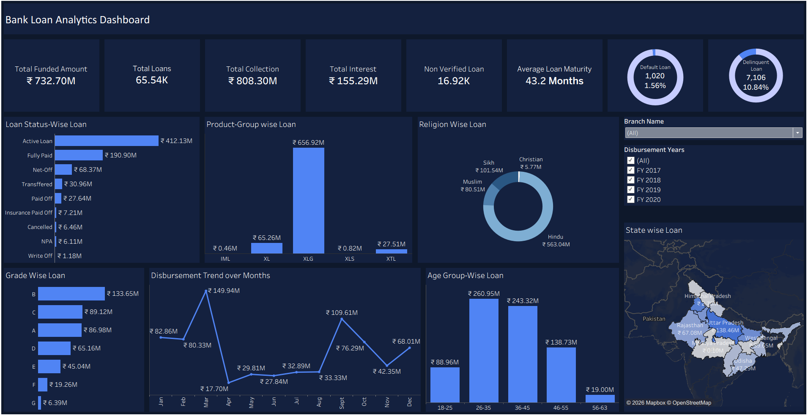
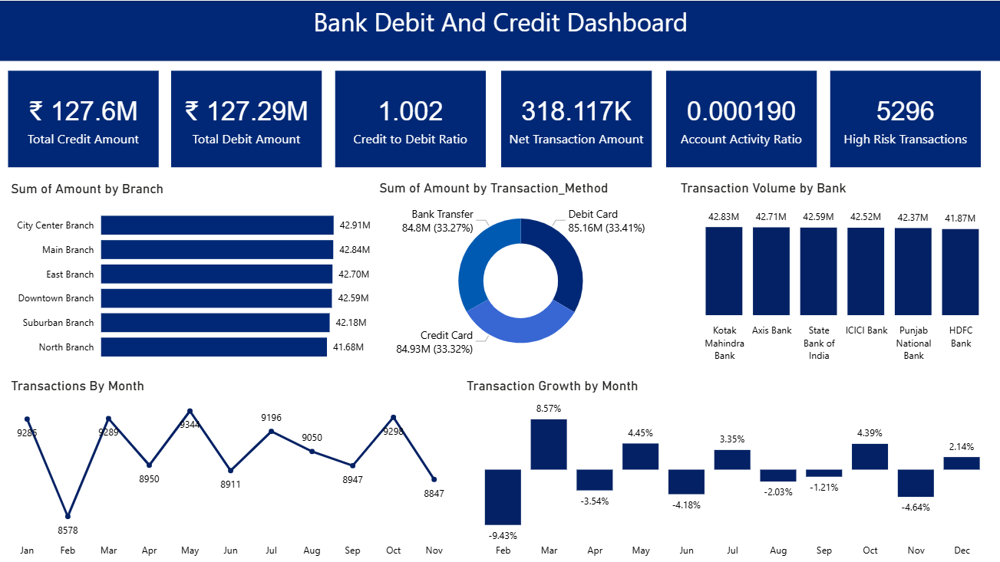

# bank-loan-and-transaction-analytics
End-to-End Bank Analytics Project analyzing Loan Portfolio &amp; Debit/Credit Transactions using Excel, SQL, Power BI, and Tableau

## 🔹 Project Overview

This project focuses on **end-to-end banking analytics**, analyzing both **Loan Portfolio Data** and **Debit & Credit Transaction Data** to evaluate performance, risk, and financial behavior.

The objective is to transform raw banking data into **actionable insights** that support decision-making, improve risk management, and enhance operational efficiency.

---

## 🔹 Datasets Used

This project is based on **two datasets**:

### 1. Loan Dataset

* Customer demographics
* Loan disbursement details
* Repayment & collection data
* Credit grades & risk indicators
* Verification status

### 2. Transaction Dataset

* Debit/Credit transactions
* Account balance & activity
* Branch & bank details
* Transaction methods
* High-risk transaction flags

---

## 🔹 Tools & Technologies

* Excel (Data cleaning & initial dashboard)
* MySQL (Data storage & querying)
* Power BI (Interactive dashboards)
* Tableau (Advanced visualization)

---

## 🔹 Project Workflow

1. Data Cleaning & Preparation
2. SQL Database Creation & Querying
3. KPI Calculation & Feature Engineering
4. Dashboard Development (Excel, Power BI, Tableau)
5. Data Validation (QA)
6. Business Insights & Recommendations

---

## 🔹 Key KPI Metrics

### 📌 Loan Portfolio KPIs

* Total Loan Amount Funded
* Total Loans Issued
* Total Collection
* Interest Revenue
* Default Rate
* Delinquency Rate
* Loan Maturity
* Non-Verified Loans

### 📌 Transaction KPIs

* Total Credit Amount
* Total Debit Amount
* Credit-to-Debit Ratio
* Net Transaction Amount
* Account Activity Ratio
* High-Risk Transaction Count

---

## 🔹 Key Insights

### 📊 Loan Portfolio Insights

* Strong portfolio performance with **collections exceeding disbursement**
* Low default rate (~1.56%) but **higher delinquency (10.84%)**
* Heavy dependence on **XLG product category**
* Loan concentration in specific states
* Majority borrowers in **26–45 age group**

### 💳 Transaction Insights

* Balanced credit and debit flow → **stable liquidity**
* Consistent performance across branches and banks
* Even distribution across transaction methods
* Presence of **high-risk transactions (fraud exposure)**
* Low account activity ratio → engagement opportunity

---

## 🔹 Business Recommendations

### 🏦 Loan Portfolio

* Improve delinquency monitoring systems
* Diversify product portfolio
* Expand into low-penetration regions
* Strengthen verification processes

### 💰 Transactions

* Enhance fraud detection systems
* Improve customer engagement
* Leverage transaction trends for marketing
* Maintain branch performance benchmarking

---

## 🔹 Dashboards Included

* 📈 Loan Analytics Dashboard (Excel, Power BI, Tableau)
* 💳 Debit & Credit Dashboard (Excel, Power BI, Tableau)

---

## 🔹 Screenshots

### Loan Dashboard

### Transaction Dashboard

---

## 🔹 Project Highlights

* ✔ Dual dataset analysis (Loan + Transaction)
* ✔ End-to-end data analytics workflow
* ✔ Multi-tool implementation
* ✔ KPI-driven business insights
* ✔ Risk and performance analysis

---

## 🔹 Conclusion

The project demonstrates strong portfolio performance with stable financial flow. While risk levels are controlled, improvements in delinquency monitoring and fraud detection can further strengthen long-term growth.

---

## 🔹 Author

**Manikutty V**

* 📧 Email: manikuttyv8@gmail.com
* 💼 LinkedIn: www.linkedin.com/in/manikuttyv
* 💻 GitHub: https://github.com/ManikuttyV

---

⭐ If you found this project useful, feel free to star the repository!
